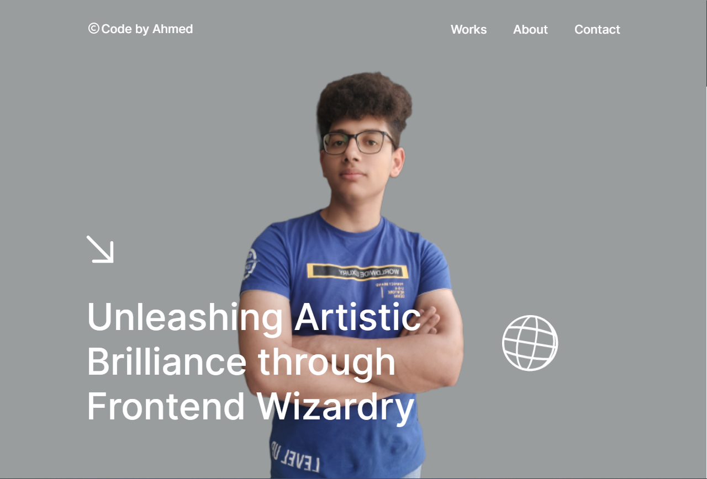

# Ahmed Ayob's Portfolio

Welcome to my GitHub portfolio! This repository serves as a showcase of my projects, skills, and contributions in the field of web development. Feel free to explore the projects listed below and connect with me to discuss collaborations, ideas, or any questions you may have.

## About Me

I'm Ahmed Ayob, a passionate web developer with experience in HTML, CSS, JavaScript, Sass, React, and TypeScript. I'm dedicated to creating elegant and functional web solutions that make a difference.

-   🌐 Portfolio: [https://thecoder512.github.io/ahmed-ayob-portofolio-with-ts/]
-   💼 LinkedIn: [https://www.linkedin.com/in/ahmed-ayob-7a9800249/]
-   📧 Email: [ahmedayobbusiness@gmail.com]
-   📱 Twitter: [https://twitter.com/1ayob_ahmed]
-   📱 Facebook: [https://www.facebook.com/ahmed.ayob.7355/]

## Protofolio

[Project Description]

-   **Tech Stack:** HTML, SCSS, TypeScript, GSAP, BarbaJs
-   **GitHub Repository:** [Link](https://github.com/thecoder512/ahmed-ayob-portofolio-with-ts)
-   **Live Demo:** [Link](https://thecoder512.github.io/ahmed-ayob-portofolio-with-ts/)

## Skills

-   HTML5
-   CSS3 and Sass
-   JavaScript (ES6+)
-   React
-   React Router
-   TypeScript
-   Responsive Web Design
-   Version Control (Git)
-   GSAP
-   BarbaJs
-   Framer Motion

## Contact

I'm open to collaboration and new opportunities. Feel free to reach out to me through one of the following channels:

-   📧 Email: [ahmedayobbusiness@gmail.com]
-   💼 LinkedIn: [https://www.linkedin.com/in/ahmed-ayob-7a9800249/]
-   🌐 Portfolio: [https://thecoder512.github.io/ahmed-ayob-portofolio-with-ts/]
-   📱 Twitter: [https://twitter.com/1ayob_ahmed]
-   📱 Facebook: [https://www.facebook.com/ahmed.ayob.7355/]

Let's connect and create something amazing together!

## License

This portfolio is licensed under the MIT License - see the [LICENSE](LICENSE) file for details.
